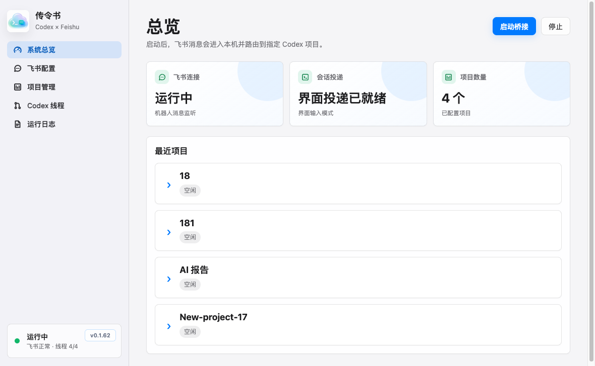
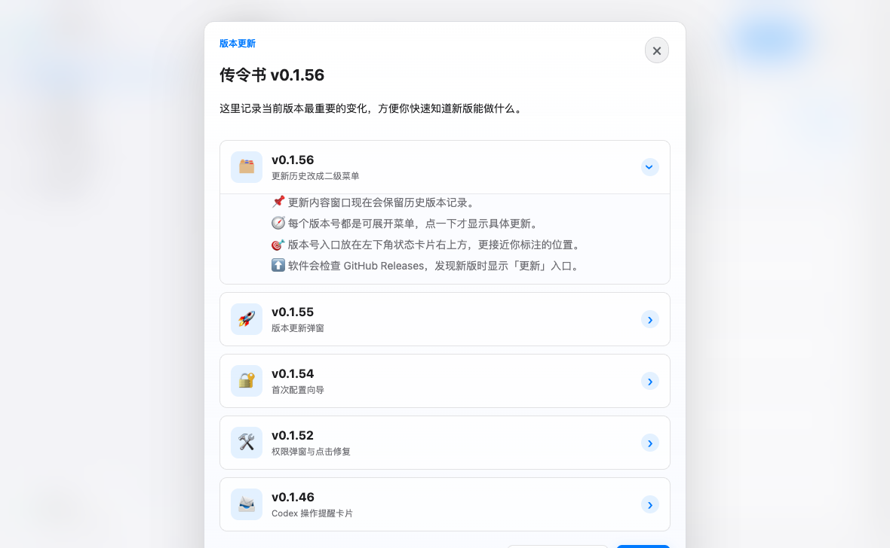

# 传令书

本项目是一个本地桌面程序，用飞书 Bot 接收你的回复，并把 Codex 项目的状态和结果推送回飞书。

> GitHub Releases：<https://github.com/huyuanfeng45/chuanlingshu/releases>

## 快速开始

1. 打开传令书，在首次配置向导里填入飞书机器人的 `App ID` 和 `App Secret`，然后把这个机器人拉进你要使用的飞书群。
2. 在 Codex 里复制当前会话 ID，把这个会话 ID 发到飞书群里，并 `@机器人` 发送。传令书收到后会把这个飞书群和对应 Codex 会话绑定起来。
3. 如果你想在群里免 `@机器人` 直接说话，需要到飞书开放平台给应用添加“获取群组中所有消息”权限，也就是 `im:message.group_msg`；开通后重新发布应用，并确认机器人仍在群里。

## 截图

### 系统总览



### 版本更新历史



## 第一版能力

- 使用飞书长连接模式接收 Bot 消息，不需要公网回调地址。
- 在本地维护多个 Codex 项目：别名、目录、线程 ID、飞书会话；新飞书群可直接发送 Codex 会话 ID 自动绑定到对应线程。
- 支持飞书命令：`/help`、`/list`、`/use`、`/status`、`/queue`、`/add`、`/bind`、`/bind-thread`、`/threads`、`/send-attachments`、`/cancel-attachments`。
- 普通飞书消息会转发到当前选中的 Codex 项目。
- 默认开启镜像模式：普通消息必须发送到已绑定的现有 Codex 线程，不会自动新建隐藏线程。
- 可选自动打开 Codex 线程：收到飞书消息后，通过 `codex://threads/<threadId>` 把 Codex App 定位到对应线程。
- 可切换投递模式：`app-server` 或 `Codex 界面输入`。界面输入模式会用剪贴板和辅助功能把飞书文本粘贴到 Codex App 并回车。
- 界面输入模式会监听本机 Codex 会话记录，把对应线程的可见处理中进展和最终回复推回飞书。
- Codex 界面输入模式不依赖 `codex app-server` 启动；`/threads`、`/attach-latest` 只是可选的线程查询辅助能力。
- Mac 休眠/唤醒后会自动恢复飞书连接和 Codex 会话监听。
- 通过 `codex app-server` 与 Codex 交互，监听 turn、plan、命令和最终回复。
- Codex 任务会在飞书里生成一张可更新任务卡，处理中进度会按设置里的“进度推送间隔”原地更新；最终回复会另外新发一张结果卡，避免结果藏在旧卡片里。
- Codex 界面里出现批准请求、输入请求或选项时，任务卡会立即切换为“等待你处理”；选择题可直接在飞书卡片里点选项继续发送到 Codex。
- 任务卡支持按钮操作：刷新状态、打开本机 Codex 线程、重新发送已完成/失败任务、追加队首、清空队列；点击“刷新状态”时会额外截取当前 Codex 线程窗口并发送到飞书。
- 支持飞书控制面板 `/panel`：查看当前会话绑定、下拉选择项目、刷新面板、查看当前项目状态。
- app-server 模式支持按项目维度排队；Codex 界面输入模式下，同群同线程的新消息会直接继续发送到已绑定 Codex 线程，不再进入应用自己的任务队列。
- 支持在飞书里直接发送图片或文件：如果消息里同时有文字，会立即合并发送给 Codex；如果只发附件，会先暂存，等待下一条文字说明后再合并发送。
- 支持 Codex 结果文件回传：最终回复里明确出现的项目目录内产物文件会自动上传回飞书；图片会优先按飞书图片消息发送，方便手机直接预览。
- 支持 GitHub Releases 更新检查：发现新版本时，左下角状态卡片会显示“更新”入口，点击后打开 GitHub 更新列表。
- 支持应用内版本历史：点击版本号会打开更新内容窗口，历史版本按二级菜单折叠展示。

## 飞书命令

```text
/help
/panel
/list
/use 项目别名
/status
/queue
/clear-queue
/send-attachments
/cancel-attachments
/add 项目别名 /absolute/workspace/path
/bind 项目别名 codex_thread_id
/bind-thread codex_thread_id
/mirror 项目别名 codex_thread_id
/attach-latest 项目别名 可选搜索词
/threads 可选搜索词
/where
/bind-chat 项目别名 可选chat_id
/unbind-chat 可选chat_id
/mode ui
/mode appserver
```

选择项目并绑定现有 Codex 线程后，直接发送普通文本、图片或文件即可继续对应 Codex 线程。飞书附件会保存到 Electron userData 下的 `feishu-attachments/日期/项目名/`，并以本机绝对路径发给 Codex。

新建一个飞书群并把机器人拉进去后，可以第一句话直接发送 Codex 会话 ID，例如 `xxxxxxxx-xxxx-xxxx-xxxx-xxxxxxxxxxxx`。如果这个线程已经属于已有项目，应用会直接把当前群绑定到该项目；如果能从 Codex 线程列表或本机 `~/.codex/sessions` 日志里查到线程目录，应用会自动创建项目并绑定；如果查不到目录且本机只有一个项目，会默认绑定到这个唯一项目。需要手动触发时也可以发送 `/bind-thread codex_thread_id`。

如果你通常是先发图片/文件、再补文字说明，可以直接按这个顺序发送。单独发送附件时，应用会先暂存 5 分钟，不会立刻发给 Codex；下一条普通文字会和暂存附件合并成同一条任务。也可以发送 `/send-attachments` 立即发送暂存附件，或发送 `/cancel-attachments` 取消暂存。

在 Codex 界面输入模式下，群聊里继续发送的新消息会直接投递到当前绑定的 Codex 线程，传令书不会再提示“排队中”。如果使用 app-server 模式，同一项目运行中收到的新消息仍会进入项目队列，当前任务结束后自动处理队首。不同项目的队列相互独立，可以同时处理。

在飞书群里发送 `/bind-chat 项目别名`，可以把当前群绑定到该项目；如果已经知道群 `chat_id`，也可以在 Mac App 的“项目 > 飞书会话绑定”里手动填写并绑定。

如果飞书开放平台没有给应用开通“获取群组中所有消息”权限，群聊里需要先 `@机器人` 再发送命令或普通消息。软件会自动去掉开头的 @，例如 `@机器人 /where` 会按 `/where` 处理。

任务卡按钮需要在飞书开放平台为应用开启卡片回调事件：`card.action.trigger`。

图片和文件转交需要机器人具备读取消息资源的权限，并且机器人必须在对应会话中。飞书当前消息资源接口仅支持下载 100MB 以内资源。

## 结果文件回传

当 Codex 最终回复里写出项目目录内的本地文件路径时，应用会自动把常见产物文件上传回飞书，例如 PDF、图片、压缩包、Office 文件、CSV、日志、HTML、音视频文件。PNG、JPG、WebP、GIF、BMP、TIFF、ICO 等图片会优先作为飞书图片消息发送；超过飞书图片消息大小限制或不适合图片消息的格式会按文件回传。

为避免误传源码或系统文件，自动回传只处理项目目录内的产物文件，不会回传常见源码扩展名。单文件最大 30MB，单次最多回传 5 个文件；超出限制时会在任务卡里提示未回传原因。

## 更新系统

应用启动后会检查：

```text
https://api.github.com/repos/huyuanfeng45/chuanlingshu/releases/latest
```

如果 GitHub Releases 最新版本号高于当前应用版本，左下角状态卡片会出现“更新 vX.Y.Z”按钮。点击后会打开：

```text
https://github.com/huyuanfeng45/chuanlingshu/releases
```

应用内版本号仍可点击查看内置中文更新历史；内置历史用于快速了解变化，GitHub Releases 用于下载安装包。

## Codex 连接排查

如果飞书能收发，但 `/threads` 或普通消息不能进入 Codex，优先检查设置里的 `Codex 命令`。从访达启动的 macOS App 通常没有 shell 的完整 `PATH`，所以建议使用绝对路径：

```text
/Users/hyf/.local/bin/codex
```

或：

```text
/Applications/Codex.app/Contents/Resources/codex
```

设置页里的“自动识别 Codex”按钮会自动写入可用路径。

## Codex 界面输入模式

如果你希望飞书消息像手动在 Codex App 里输入一样触发界面实时变化，把设置里的“投递模式”改为 `Codex 界面输入`。

这个模式的主链路不依赖 `codex app-server`：飞书消息会直接打开已绑定的 Codex App 线程，粘贴到输入框，并通过本机 `~/.codex/sessions` 监听最终回复。`/threads`、`/attach-latest` 和设置页里的“测试 Codex”仍会尝试使用 `app-server` 查询线程，但它们失败不会影响已绑定线程的收发。

这个模式需要 macOS 辅助功能权限：

```text
系统设置 > 隐私与安全性 > 辅助功能 > 允许 传令书
```

任务卡“刷新状态”按钮会打开对应 Codex 线程并截图发回飞书。这个截图能力还需要 macOS 屏幕录制权限：

```text
系统设置 > 隐私与安全性 > 屏幕录制 > 允许 传令书
```

如果粘贴没有进入输入框，先在 Codex 线程底部输入框点一下，再从飞书重发消息。

界面输入模式下，Codex 的回复不是从桥接程序自己的 `codex app-server` 返回，而是从本机 `~/.codex/sessions` 中监听已绑定线程的新增完成消息。因此必须先把项目绑定到真实 Codex 界面线程。

如果 Mac 休眠后恢复，应用会重新同步已绑定线程、重启会话监听，并重连飞书长连接。

## Star History

[](https://www.star-history.com/#huyuanfeng45/chuanlingshu&Date)
